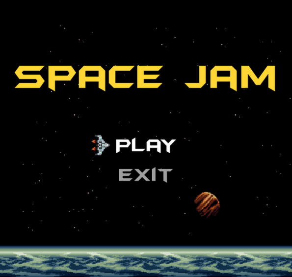
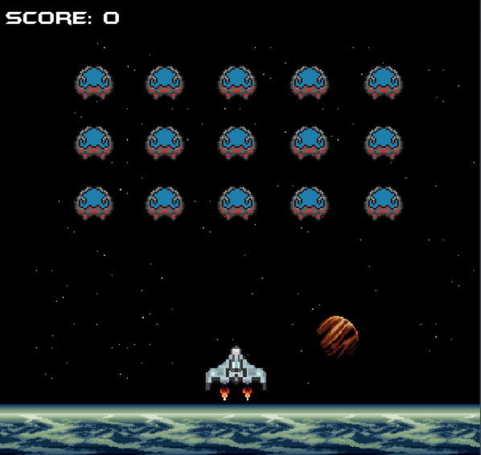

# space-jam

A retro-style space shooter built with Python and Pygame. I made this in highschool and is the first real projectg I ever coded.

<p>
  
  
</p>

## Features

- 15 enemies arranged in a grid formation to fight through
- Laser combat with hit detection and explosions
- Score tracking throughout gameplay
- Main menu, pause menu, and victory screen
- Background music and sound effects (menu music, in-game music, victory theme)
- Custom retro font and pixel art sprites

## Installation

### Prerequisites

- Python 3
- Pygame

### Setup

1. Install Pygame:

   ```bash
   pip install pygame-ce
   ```

2. Run the game:
   ```bash
   python "Space Game.py"
   ```

## Controls

| Key                     | Action             |
| ----------------------- | ------------------ |
| Arrow Keys (Left/Right) | Move spaceship     |
| Space                   | Shoot laser        |
| Escape                  | Pause game         |
| Up/Down Arrow           | Navigate menus     |
| Enter                   | Select menu option |
